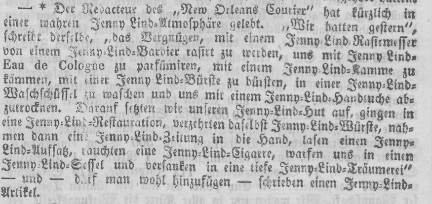

# Automatische Mastodon-Posts der Reihe #zeitfürzeitungen

Danke, dass ihr eure kuriosen Funde für die Reihe #zeitfürzeitungen teilen möchtet. Mit dieser Anleitung könnt ihr eure Posts in die Warteschlange aufnehmen. Jeden Mittwoch um 12:00 wird der erste Post aus der Warteschlange automatisch auf Mastodon (https://fedihum.org/@zeitungen_zeitschriften) veröffentlicht. Außerdem werden die Posts entsprechend für Instagram (https://www.instagram.com/zeitungen_zeitschriften/) eingeplant. Wenn euer Post an einen bestimmten Tag veröffentlicht werden soll, ist auch das möglich.

## Schritt 1: Den Post vorbereiten

Alle Posts sollen aus einem Bild des Fundes und einem kurzen Text bestehen.

- Das Bild sollte in der Regel keine gesamte Zeitungsseite sein, sondern ein Ausschnitt, der den konkreten Fund enthält.
- Der Text (maximal 500 Zeichen) soll nach Möglichkeit wie folgt aufgebaut sein:
  - Knappe Beschreibung des Fundes mit Titel, Autor, Veröffentlichungsmedium, Datum und Name des Portals, jeweils soweit bekannt.
  - Gefunden von [Name] (falls gewünscht)
  - Ungekürzter Link zum Digitalisat, beginnend mit http:// oder https://. Links werden für das Zeichenlimit immer mit 23 Zeichen gezählt.
  - #zeitfürzeitungen
  - Gerne dürfen auch weitere, thematisch passende Hashtags verwendet, oder Portale verlinkt werden. (Für Instagram werden etwaige von Mastodon abweichende Handles während der Postplanung korrigiert/ergänzt.)
 
In den nachfolgenden Schritten wird beschrieben, wie der Post über das GitHub-Interface in die Warteschlange aufgenommen werden kann. Wer sich mit GitHub auskennt, kann aber natürlich auch einfach das Repository klonen und lokal bearbeiten.
 
## Schritt 2: Das Bild hochladen

Das Bild wird in den Ordner "images" hochgeladen. Dafür in GitHub links den Ordner "images" anklicken. Es werden alle Dateien im Ordner angezeigt. Nun oben rechts "Add new file" -> "Upload files" auswählen. Die Datei auswählen und abschließend mit "Commit changes" (grüner Button) bestätigen. Am besten benennt ihr euer Bild mit einem eingängigen Namen, damit es nicht zu Dopplungen kommt.

## Schritt 3: Den Post in die Tabelle aufnehmen

Hier muss nun zuerst entschieden werden, ob der Post regulär am Mittwoch, oder an einem festgelegten Tag ausgeführt werden soll.
- Regulärer Post am nächstmöglichen Mittwoch: Bitte die Datei "post_queue.csv" bearbeiten.
- Post an bestimmtem Datum: Bitte die Datei "post_scheduled.csv" bearbeiten.

Zum Bearbeiten der Datei auf diese klicken und dann oben rechts den kleinen Stift ("edit file") auswählen. Nun kann die Datei bearbeitet werden. Es handelt sich um eine CSV-Datei mit Semikolon als Trennzeichen. Die Spalten wie folgt füllen:
- text: Der Text für den Post. Achtung! Hier dürfen keine Semikolons enthalten sein.
- image: Den exakten Dateinamen der Datei.
- date (nur in der Tabelle post_scheduled.csv): Das Datum, an dem gepostet werden soll im Format YYYY-MM-DD

Bei den datierten Posts bitte außerdem den Post chronologisch korrekt einordnen. 

Anschließend kann wieder mit "Commit Changes" bestätigt werden.

## Beispiel

### Bild
*jstoe_JennyLind1851.png*


### Text
Bericht über die Jenny-Lind-Atmosphäre in New Orleans in der Kölnischen Zeitung vom 14.09.1851. Gefunden im deutschen Zeitungsportal von Johanna Störiko. https://www.deutsche-digitale-bibliothek.de/newspaper/item/T2I6CYPFWF35YTQCOSUEODVMNJEQKLGV?issuepage=16 #zeitfürzeitungen

### Tabelle

*Ohne Datum*

```
"Bericht über die Jenny-Lind-Atmosphäre in New Orleans in der Kölnischen Zeitung vom 14.09.1851. Gefunden im deutschen Zeitungsportal von Johanna Störiko. https://www.deutsche-digitale-bibliothek.de/newspaper/item/T2I6CYPFWF35YTQCOSUEODVMNJEQKLGV?issuepage=16 #zeitfürzeitungen";jstoe_JennyLind1851.png
```

*Mit Datum*

```
"Bericht über die Jenny-Lind-Atmosphäre in New Orleans in der Kölnischen Zeitung vom 14.09.1851. Gefunden im deutschen Zeitungsportal von Johanna Störiko. https://www.deutsche-digitale-bibliothek.de/newspaper/item/T2I6CYPFWF35YTQCOSUEODVMNJEQKLGV?issuepage=16 #zeitfürzeitungen";jstoe_JennyLind1851.png;2025-04-01
```
